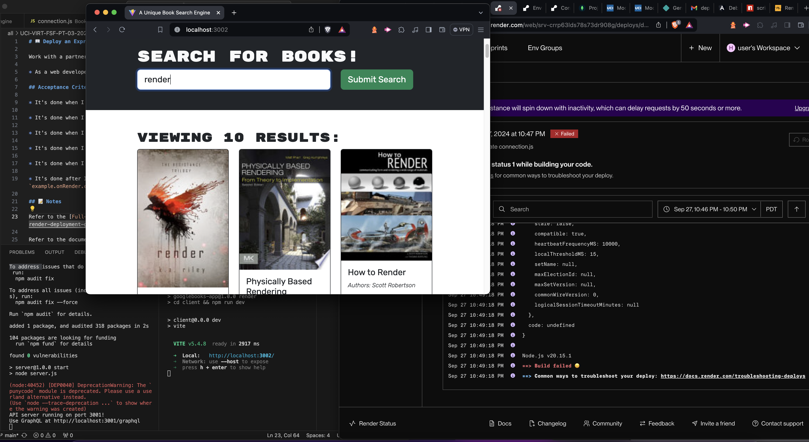

<h1 id="title">ReadMe file for "A Unique Book Search Engine"</h1>
<h3>By User davehyler</h3>
<!-- Optional Screenshot will show if user places one within the same directory as this readme. -->

 

https://unique-book-search-engine.onrender.com/
Have changed every setting on Render (including to the exact "Deployment Guide" we were given). The only feedback needed is not HOW to fix it, but where specifically in student instructional documentation we were given explicit directions to however it SHOULD have been deployed since the "Deployment Guide" values for Render either do not work. Have used the starter code link, have used localhost, have even tried to deploy on atlas (not that it matters as it seems all meaningful data is coming directly from the API and we have not "created a database" any different/unique from anyone else doing this assignment. Will not be continuing work on Render without explicit instructions on what needs to be done for deployment PRIOR to starting/revisiting an assignment as it always seems to require something different from the deployment guide (as this entire program now works perfectly fine on localhost now that the missing files were uploaded, therefor the only difference is a NECESSITY for Render Deployment that I don't seem to see anywhere within the deployment guide or our student materials. Please send a direct link or identifier to the page if incorrect.
  
As an Master's of Education, I focus less on whether "it works" or "it doesn't work" and more "was the class provided a deployment document that gives us the necessary instructions/parameters to deploy an application like THIS to render? Or was that part missing for any reason?"
<nav>
<h2>Table Of Contents</h2>
<ol>
<li><a href="#title">Title</a></li>
<li><a href="#username">Username</a></li>
<li><a href="#email">Email</a></li>
<li><a href="#stack">Stack</a></li>
<li><a href="#license">License</a></li>
<li><a href="#description">Description</a></li>
<li><a href="#instructions">Installation Instructions</a></li>
<li><a href="#guidelines">Guidelines</a></li>
<li><a href="#testing">Testing</a></li>
</ol>
</nav>
<ul class="list-group">
<h2>Project Information</h2>
<h3 id="stack">Stack used:</h3>

<h3 id="license">License: MIT</h3>

Badge: 

<h3 id="description">Description of project:</h3>

A unique Book Search Engine

<h3 id="instructions">Installation Instructions:</h3>
1. Do not use Render until documentation has been provided that will deploy this WORKING application in the same way it runs locally. (It certainly exists, but "Deployment Guide For Render" is not it and I don't think we received a follow up to that document)
2. Clone the repository
3. From the root directory, type "npm run install" and press enter.
4. From the root directory, type "npm run render" and press enter.
5. The application will both load and automatically popup
6. These are how step by step directions work. For the opposite of this clear and concise procedure, please refer to "Deployment Guide For Render" (which also has two incorrect statements/pictures that appear to be from a severely outdated version of their website: See "Build and Deployment" section)
<h3 id="guidelines">Guidelines for Contribution:</h3>

Make sure all submissions are compatible with the current codebase.

<h3 id="testing">Tests</h3>

Make sure to install "jest" prior to testing.

</ul>
<h3>Questions? Contact Me:</h3>
<ul class="list-group">
<li class="list-group-item">GitHub username: davehyler</li>
<li class="list-group-item">Email:  davehyler@github.com (placeholder, do not use. Will not post personal information on assignments present on publicly scrapable websites)</li>
</ul>
